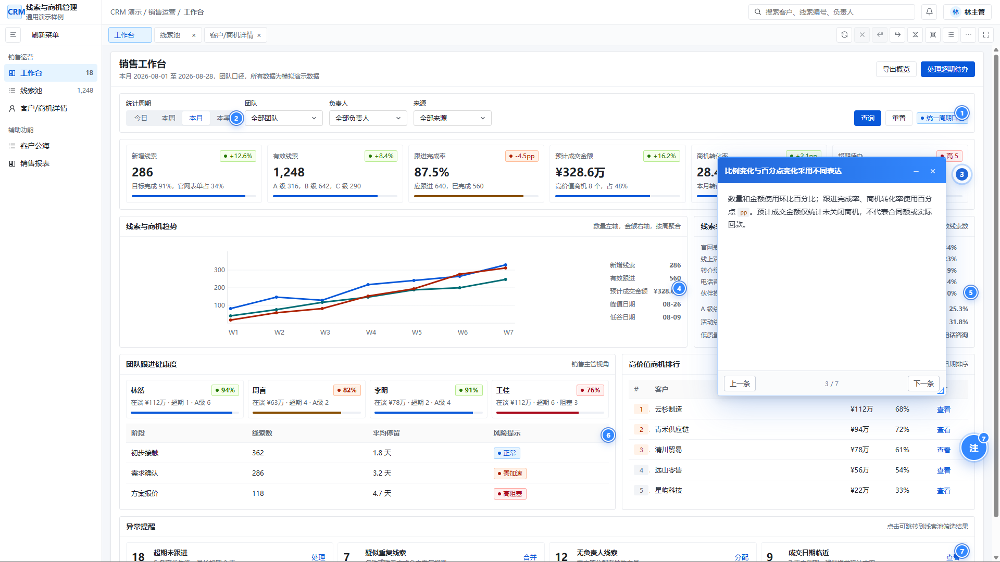
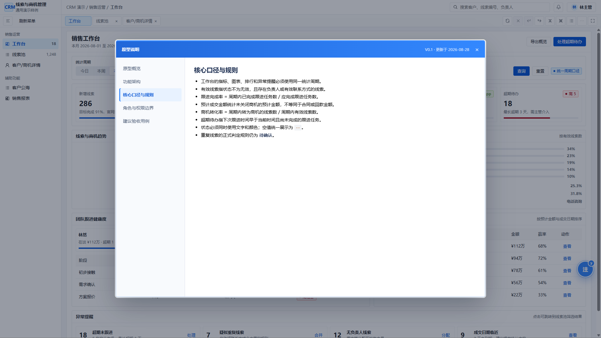
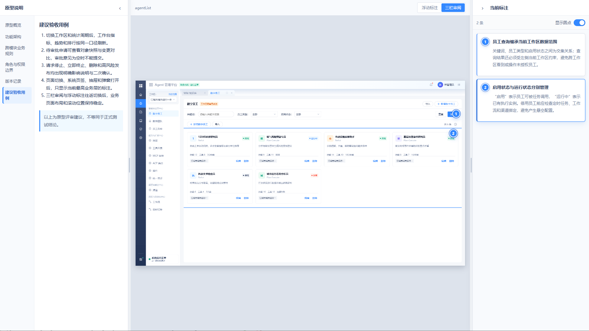
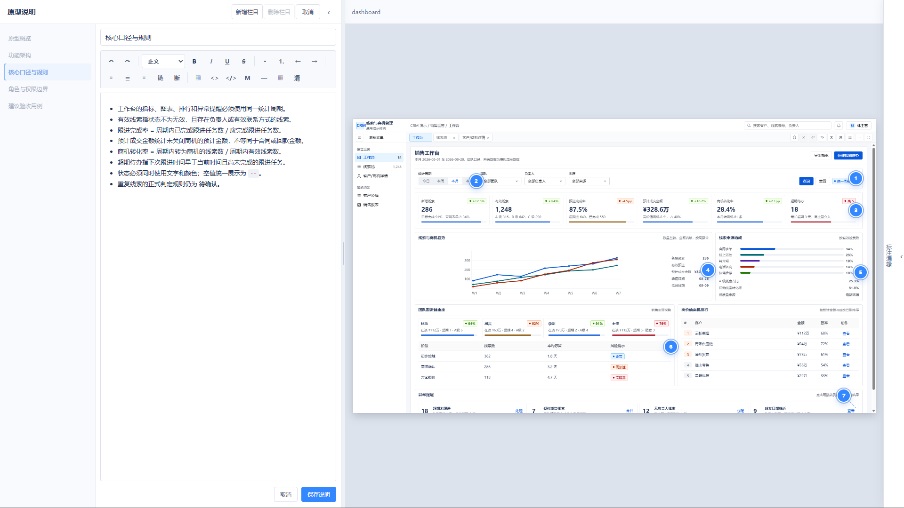
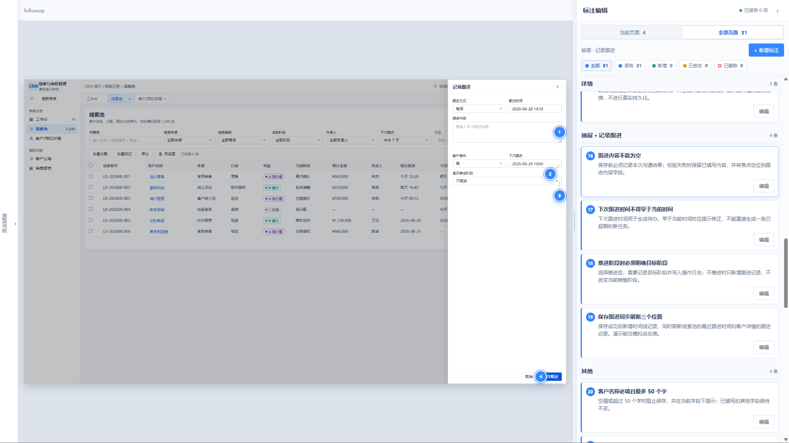
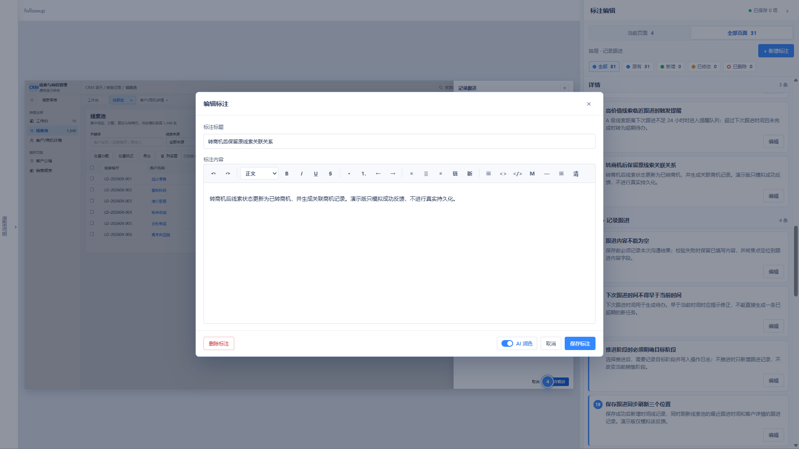
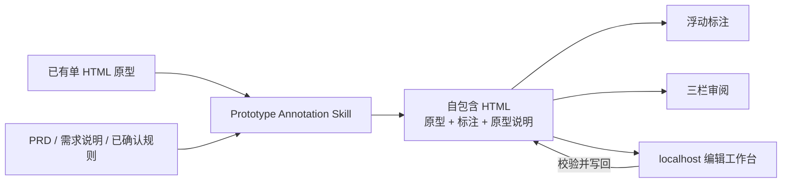

# 原型标注（Prototype Annotation）

[](https://github.com/lin96008-maxlin/prototype-annotation/actions/workflows/ci.yml)
[](./LICENSE)
[](./prototype-annotation/SKILL.md)
[](#最终交付是什么)


让 HTML 原型自己解释业务，而不是让产品经理在原型、PRD、会议记录和聊天消息之间来回寻找答案。

传统评审中，界面展示“长什么样”，PRD 解释“为什么这样设计”，口头沟通再补充权限、状态、口径和异常流程。材料一多，版本很快失去对应关系：评审者不知道说明属于哪个页面，研发也难以确认某条规则对应哪个控件。

Prototype Annotation 把这些信息重新绑定到原型本身。它为已有 Web 或移动端单 HTML 原型生成可定位的业务标注和跨页面原型说明，并提供浮动标注、三栏审阅及 localhost 可视化编辑。最终仍只交付一份可离线打开的 HTML。

**核心定位：一份 HTML，同时承载可交互原型、PRD 关键规则和评审上下文。**

## 核心价值

- **原型与规则保持对应**：标注直接绑定筛选区、字段、指标、状态、操作按钮或弹层，不再依赖文档中的模糊截图编号。
- **减少零散交付物**：页面说明、功能架构、角色权限、业务规则、版本记录和验收建议可随原型封装在同一 HTML 中。
- **让评审更聚焦**：浮动模式适合边操作边查看；三栏模式适合集中汇报、逐条核对和跨页面评审。
- **让修改真正写回**：本地编辑器可以新增栏目、定位页面元素、拖动圆点、修改正文，并把结果安全写回原文件。
- **同时覆盖 Web 与移动端**：同一套标注数据模型适配 Web 页面、移动端页面、Tab、抽屉、Bottom Sheet 和 Dialog。
- **离线、可传递、无服务依赖**：最终 HTML 内嵌样式、运行时、Markdown 与 Mermaid，不依赖 CDN、网络图片或业务后端。

## 功能展示

> 以下截图使用演示数据，仅用于展示 Skill 的交互与呈现能力。

### 浮动模式：查看标注

标注圆点跟随真实页面元素。点击圆点即可查看当前规则，并可在同一作用域内切换上一条、下一条；业务页面、抽屉和弹窗只显示当前最高层级的标注。



### 浮动模式：查看原型说明

不离开当前业务页面即可打开完整原型说明。说明栏目根据需求材料动态组织，可集中呈现原型范围、功能架构、核心口径、角色权限、验收建议和待确认事项。



### 三栏模式：把说明、原型和标注放在同一视野

左侧集中展示跨页面原型说明，中间保持固定比例业务画布，右侧显示当前页面或弹层的标注。两侧栏支持调宽和收起，适合评审会议与汇报演示。



### 标注编辑：编辑原型说明

在 localhost 编辑工作台中新增、删除和调整说明栏目，使用富文本、列表、表格、代码块或 Mermaid 维护业务背景、功能架构、角色权限、跨模块规则和验收建议。



### 标注编辑：点击标注快速定位页面

编辑器按页面、Tab 和弹层作用域组织全部标注。点击右侧标注后，工作台自动切换到对应页面或弹层并定位目标元素，避免在长原型中手工寻找控件。



### 标注编辑：编辑浮点标注

每条浮点标注可独立修改标题和正文，也可调整位置、目标与作用域。开启 **AI 润色** 后，Codex 会结合用户填写的标注内容、原始背景材料和已确认的业务规则优化表达，使说明更完整、清晰且便于评审；不会凭空增加未经确认的业务事实。保存后由 Skill 执行质量检查，再将本轮修改写回原 HTML。



## 主要能力

| 领域 | 能力 |
| --- | --- |
| 标注生成 | 根据 HTML、PRD、需求说明和对话材料，生成字段含义、计算口径、权限、状态、校验、流程及异常处理标注 |
| 原型说明 | 按材料动态组织原型概览、功能架构、业务规则、角色权限、版本记录、风险和验收建议，不强制套固定目录 |
| Web 审阅 | 浮动标注与三栏审阅两种同级模式；支持页面、系统页签、抽屉、弹窗及最高作用域切换 |
| 移动端审阅 | PC 三栏与手机视口自动切换；支持页面 Tab、Bottom Sheet、Dialog 和业务正文滚动定位 |
| 可视化编辑 | localhost 三栏工作台；支持栏目编辑、标注增删改、圆点拖动、跨页面定位和单条 AI 润色 |
| AI 润色 | 结合用户填写内容、原始背景材料和已确认规则优化单条标注表达，不替用户补造事实 |
| 安全写回 | 独立编辑会话、HTML 基线哈希、冲突阻止、失败回滚、增量验证计划 |
| 内容质量 | 拦截低价值标注、通用容器滥用、重复坐标、重复正文、不稳定选择器和异常文本 |
| 单文件交付 | 自动内嵌 CSS、运行时、Marked、Mermaid 和第三方许可告知，断网仍可查看 |

## 工作方式



Skill 不重新设计业务 UI。它只在已有原型上补充必要的无视觉定位属性、结构化标注数据和审阅层，并在每次注入或写回后执行质量门禁。

## 安装

### 环境要求

- 已安装并可使用 Codex；
- 已安装 Python 3，用于运行 Codex 内置 Skill 安装器；
- 已安装 Node.js 18 或更高版本，用于标注注入、localhost 编辑和写回。

### 方式一：使用 Codex 内置安装器

PowerShell：

```powershell
python "$HOME\.codex\skills\.system\skill-installer\scripts\install-skill-from-github.py" `
  --repo lin96008-maxlin/prototype-annotation `
  --path prototype-annotation
```

macOS / Linux：

```bash
python ~/.codex/skills/.system/skill-installer/scripts/install-skill-from-github.py \
  --repo lin96008-maxlin/prototype-annotation \
  --path prototype-annotation
```

安装器会将 Skill 安装到 `~/.codex/skills/prototype-annotation`。如果同名目录已经存在，安装器会停止，避免覆盖现有内容。安装成功后，从下一轮 Codex 对话开始使用。

### 方式二：手动安装

PowerShell：

```powershell
git clone https://github.com/lin96008-maxlin/prototype-annotation.git
New-Item -ItemType Directory -Force "$HOME\.codex\skills" | Out-Null
Copy-Item -Recurse ".\prototype-annotation\prototype-annotation" "$HOME\.codex\skills\prototype-annotation"
```

macOS / Linux：

```bash
git clone https://github.com/lin96008-maxlin/prototype-annotation.git
mkdir -p ~/.codex/skills
cp -R ./prototype-annotation/prototype-annotation ~/.codex/skills/prototype-annotation
```

## 使用方式

不需要记忆脚本命令。正常情况下只需在 Codex 对话中点名 `$prototype-annotation`，并提供目标 HTML 路径与已有需求材料。

### 生成标注与原型说明

在 Codex 中发送：

```text
使用 $prototype-annotation，为 C:\path\to\prototype.html 添加业务标注和原型说明。
```

可以同时提供 PRD、需求说明、会议纪要或已确认的业务规则。Skill 会判断 Web 或移动端，补充必要的无视觉定位属性，并把标注框架写入同一个 HTML。

### 检查或优化已有标注

```text
使用 $prototype-annotation，全面检查 C:\path\to\prototype.html 的标注、作用域、定位和原型说明。
```

### 进入本地编辑模式

```text
使用 $prototype-annotation，打开 C:\path\to\prototype.html 的标注编辑模式。
```

Codex 会启动 localhost 编辑服务并返回实际 `editUrl`。编辑工作台支持：

- 新增、删除和修改原型说明栏目；
- 新增、拖动、删除和修改标注；
- 当前页面与全部页面切换；
- Web 与移动端统一三栏编辑；
- 单条标注选择 AI 润色；
- 保存编辑会话并写回原 HTML。

### 应用本轮修改

完成编辑后回到 Codex 对话并发送：

```text
使用 $prototype-annotation，应用本轮标注修改。
```

Skill 会读取当前 HTML 的活动编辑会话，刷新展示框架，执行质量检查并按变更范围决定是否需要浏览器复核。

## 什么值得标注

标注的价值不在数量，而在于解释界面本身无法表达的规则。

| 应该标注 | 不应只做这种标注 |
| --- | --- |
| 指标统计口径、数据范围和更新时间 | “这里展示一个指标卡” |
| 字段含义、默认值、必填条件和校验失败处理 | “这里可以输入内容” |
| 不同角色的可见范围和操作权限 | “点击按钮进行操作” |
| 状态流转、前后置条件和不可逆影响 | “支持查看详情” |
| 批量操作的适用对象、部分失败与重试规则 | “支持批量处理” |
| 空状态、加载失败、超时和异常恢复方式 | “页面支持刷新” |

没有材料支持的规则必须标为“待确认”，不能根据行业常识补造。

## 适用场景

适合：

- 产品原型评审、需求澄清和内部汇报；
- 需要把跨页面规则、权限、状态流转或计算口径与页面绑定的场景；
- 需要交付单个自包含 HTML，而不希望同时维护多份零散说明文档的团队。

不负责：

- 重新设计业务页面；
- 替换现有 UI 设计体系；
- 根据零散需求从头生成完整业务原型；
- 在没有事实依据时补造业务规则。

运行过程只读取 `prototype-annotation/` 目录内的自身资源，不需要额外安装配套能力。没有目标 HTML 时会请求用户提供文件，不会自动切换为原型生成任务。

## 原型要求

- 输入必须是完整的单 HTML 文件。
- Web 或移动端业务界面应具有唯一 `[data-proto-app]` 根节点。
- 根节点声明 `data-proto-platform="web"` 或 `data-proto-platform="mobile"`。
- 页面、Tab、抽屉、Bottom Sheet 和 Dialog 使用独立 `data-proto-scope`。
- 图片应内嵌为 data URI；最终文件不依赖本地相对路径或网络资源。

缺少这些属性时，Skill 只补充必要的无视觉定位契约，不改动业务视觉。

## 最终交付是什么

最终产物仍是一份普通 `.html` 文件，可以直接用浏览器打开、通过聊天工具传递，或上传到任意静态文件托管平台。它包含：

- 原有业务原型及交互；
- 结构化业务标注数据；
- 跨页面原型说明；
- Web 或移动端审阅界面；
- Markdown 与 Mermaid 离线渲染能力；
- 必要的第三方许可证告知。

localhost 编辑器只在本机编辑时临时注入，不会作为编辑能力写入最终交付文件。

## 本地编辑数据

编辑服务会在原型文件旁创建：

```text
.prototype-review/{prototypeKey}/
├─ manifest.json
└─ sessions/{sessionId}.json
```

这些文件保存未应用的编辑会话，可能包含业务说明。请按项目的数据安全要求管理，不要将真实敏感信息提交到公共仓库。

## 目录结构

| 路径 | 用途 |
| --- | --- |
| `prototype-annotation/SKILL.md` | Skill 入口、任务路由、职责边界和验证分级 |
| `prototype-annotation/agents/` | Codex 界面名称、描述和默认调用提示 |
| `prototype-annotation/references/` | Web、移动端和编辑写回的详细规则 |
| `prototype-annotation/assets/` | 两端展示运行时、共享编辑器、Marked 与 Mermaid |
| `prototype-annotation/scripts/` | 注入、写回、质量审计和回归脚本 |
| `prototype-annotation/tests/` | Web/Mobile 正例、反例和回归夹具 |
| `docs/images/` | README 功能截图，可用同名文件直接替换 |
| `.github/` | 持续集成、贡献指南和安全说明 |
| `LICENSE` | 本项目自研部分的 MIT License |
| `THIRD_PARTY_NOTICES.md` | 第三方组件与许可证边界 |

## 技术说明

- 注入与写回脚本使用 Node.js 标准库，无需业务后端。
- Marked 用于 Markdown 渲染，Mermaid 用于流程图和架构图渲染。
- 最终 HTML 会保留必要的第三方许可证告知。
- `tests/` 用于 Skill 自身回归，不会进入用户的原型数据。

## 质量检查

无需安装业务依赖即可运行 73 项 Skill 回归：

```bash
node prototype-annotation/scripts/test-skill.mjs
```

73 项回归覆盖 Web/Mobile 注入、重复注入幂等、旧框架受控迁移、编辑写回、作用域契约、低价值标注拦截、外部资源拦截和 Skill 自包含审计。GitHub Actions 会在每次推送和 Pull Request 时运行脚本语法检查、完整回归，并额外检查两端第三方许可保留逻辑。

浏览器级编辑器回归需要本地已安装 Playwright：

```bash
node prototype-annotation/scripts/qa-editor-platform.cjs
```

## 安全与隐私

- 不要把真实客户名称、内部系统地址、账号、密钥、Token 或未脱敏业务数据提交到公共仓库。
- `.prototype-review/` 可能保存尚未写回的业务说明和编辑会话，已被 `.gitignore` 排除，但仍需按项目要求管理。
- localhost 编辑链接包含随机会话 Token，只应在本机使用，不要转发或映射到公网。
- 最终 HTML 会包含原型与说明的完整内容，外发前应按接收对象检查数据边界。
- 安全问题请通过 [GitHub Private Vulnerability Reporting](https://github.com/lin96008-maxlin/prototype-annotation/security/advisories/new) 私下反馈，详细说明见 [SECURITY.md](./.github/SECURITY.md)。

## 参与贡献

欢迎产品经理、设计师和开发者提交使用场景、兼容性问题、内容质量规则和交互改进。提交代码前请阅读 [贡献指南](./.github/CONTRIBUTING.md)，并确保没有包含真实业务数据或公司专属信息。

## 开源许可

本项目自研部分采用 [MIT License](LICENSE)。第三方组件的许可证与归属见 [THIRD_PARTY_NOTICES.md](THIRD_PARTY_NOTICES.md) 及 `prototype-annotation/assets/web-annotation/` 下的原始许可证文件。
